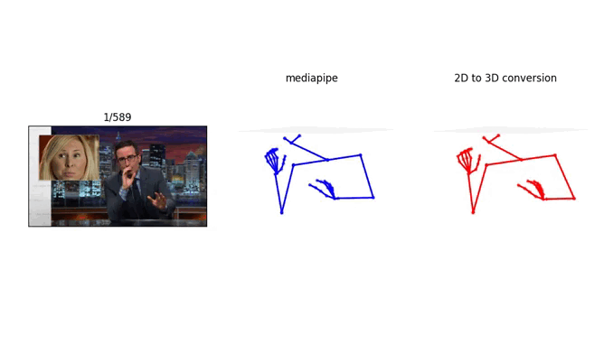

## UE Projet de Fin d'Étude

Ceci represente notre livrable pour notre Projet de Fin d'Étude : __Modélisation par apprentissage du comportement verbale et non verbal d'un agent virtuel__ , plus spécifiquement de la tache  de __"Conversion de pose 2D à 3D"__.

Membres du goupe :
  - Begum Bekiroglu
  - Yasmine Djabri
  - Nacereddine LADDAOUI

---
## Intro
The main subject of this repository is to build a neural network model that predicts the upper body 3D pose from 2D pose. This work is designed to fit for ISIR's  [virtual agent](https://github.com/isir/greta).

Our work is structured as so :
- Data preparation
- Training part
- Convert the 3D pose into BVH, to feed them into the the virtual agent.


## Demo 
In order to evaluate our script we provided a `demo.py` script that compares between 3D extracted skeleton ground truth and the 2D to 3D conversion model (the 2D skeleton we need for this task is also the 3D ground truth skeleon without the depth information). In order to evaluate the model efficiently, the demo script takes in consideretion input from the webcam and from the PATS dataset itself (cool right!), theses different tasks could be specified using arguments passed to the script.

### webcam


```
./demo.py --model path/to/model.tflite
          --num_threads 6 (default 6)
          --webcam
```

### PATS

```
./demo.py --model path/to/model.tflite
          --num_threads 6 (default 6)
          --from_json path/to/sorted.json
          --set (train/dev/test)
          --speaker (from 22 speakers)
          --video (video title of the speaker)
          --interval (annotated intervals of the video)
```
To perform a demo on PATS Dataset, the script reads from the `sorted.json` video intervals that contains poses.
```
./demo.py --model models/linear_model.tflite  \
          --from_json data/sorted.json \
          --set test \
          --speaker oliver \
          --video Marketing_to_Doctors__Last_Week_Tonight_with_John_Oliver_HBO-YQZ2UeOTO3I.mkv \
          --interval 101665 \
          --save
```

### Results

<p align="center">
   
</p>

## Integration to Greta


In order to adapt the positions found to the virtual agent Greta, we have first converted the poses that we have as numpy files to .bvh files using numpy-to-bvh.py module. Then, to transform our poses so that they can be interpretable by Greta the module "fix_bvh_for_GRETA.py" in the following git can be used: https://github.com/Michele1996/PFE-OpenPose-to-VAE-to-BVH.
