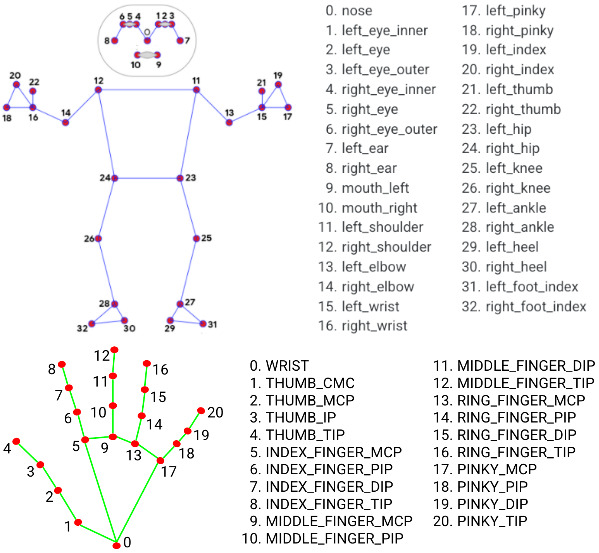

## Presentation

The [Pose, Audio, Transcript, Style (PATS)](https://chahuja.com/pats/) dataset was initially intended for style transfer between different speakers, this database links different verbal and non-verbal behavior characteristics of a person, such as __speech__, __voice tone__ and __pose__ [1]. To download it, you must fill the following [form](https://chahuja.com/pats/download.html). This large dataset (130 Go!), is constituted of 22 speakers, with more than 251 hours of video and about 84 000 annotated intervals in total.

## Build data

However, in all PATS annotations : `text`, `audio` and `pose`, we only interest to `pose`. It contains 52 upper body joints, including head, neck, arms and hands. To understand the structure of the dataset, let's take an example : A __speaker__ is composed of several __videos__ (referenced as web links), each video is divided into  __intervals__, with each interval containing several annotated __frames__, here with __pose__ information. Since 3D pose  isn't provided, we'll apply a 3D pose extraction algorithm  for each frame, here we use [mediapipe's holistic](https://google.github.io/mediapipe/solutions/holistic.html) in order to extract a realistic 3D pose skeleton that matches the joints included in PATS.
 
 ## Convert to JSON
 
Before extracting pose, the first step is to execute the `csv_to_JSON.py` file. This converts the provided `cmu_intervals_df.csv`, where video links for each speaker and their `interval_ids` are stored, to a json file more readable and easier to execute for the following step. This by executing the following command :

> This command needs to have acces to  `cmu_intervals_df.csv` and `missing_intervals.h5` by specifying the path their path in the args. By default the output path is the current working directory.

```
./csv_to_JSON.py    --intervals  path/to/cmu_intervals_df.csv \
                    --missing    path/to/missing_intervals.h5 \
                    --output     where/to/store/sorted.json
```

## Extract 3D poses

The second script `pose.py` does the data extraction part. Where its role is to manage to download the video, clip it, read the 2D pose from the correct folder, extract the 3D pose.

```
./pose.py
```

### Skeleton adaptation

A major point in this part is to match the holistic's skelton with PATS's skeleton. Since these two algorithms don't agree onto the same skeleton format (same joints have sometimes different indecies), we need to lake a **skeleton conversion** from mediapipe's to a PATS-like skeleton.

<p align="center">
   
</p>

### Scaling and shifting
 
While performing a holistic's detection using mediapipe, we noticed a difference between the hands and the body. Since the model uses the other defined modules such as pose, hand, and face, to perform this task and assemble their outputs into one structure. This is shown by the following diagram from mediapipe's site :
<p align="center">
  
</p>
In fact, this step causes an offset and scale difference between hands and body. First the offset : between the hand root and wrist points, since the hand detector performs a depth estimation that is centerd at 0. This could be fixed by translating the hand depth to the wrist. The second difference is in the depth scale between the hand and the body, since the two estimations aren't related, it arent at the same scale, so we rescale the hand.


---
```
[1] Chaitanya Ahuja, Dong Won Lee, Yukiko I. Nakano, and Louis-Philippe Morency. "Style Transfer for Co-Speech 
    Gesture Animation: A Multi-Speaker Conditional-Mixture Approach." ECCV 2020
```
